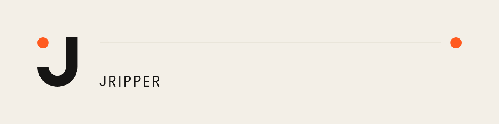

<picture>
  <source media="(prefers-color-scheme: dark)" srcset="assets/banner-dark.svg">
  
</picture>

## Technology × Design × Curiosity

A personal lab where I build, experiment, take photos and follow whatever sparks my curiosity.
I'm interested in how people perceive and experience interactions — with each other, with objects and with interfaces.

I build things, break them and occasionally manage to fix them.

### Closure Log

| | Area | Project | Status |
|:-:|---|---|---|
| ◐ | Browser tools & UX | **Steam Intel** · private project | alpha |
| ◐ | IoT & Hardware | [bezel](https://github.com/jripper77/bezel) | under construction |
| ○ | Web experiments | [wiki-proxy](https://github.com/jripper77/wiki-proxy) | open |
| ○ | AI & Automation | [AutoGPT](https://github.com/jripper77/AutoGPT) | open |

**Steam Intel** — a Chrome extension that brings price comparisons and game insights to Steam store pages and wishlists.

bezel and AutoGPT are forks: explorations built on [Bezel Studio](https://github.com/slipalison/bezel) and [AutoGPT](https://github.com/Significant-Gravitas/AutoGPT).

### What I'm into

AI & Automation · Home Assistant · IoT & Hardware · UX/UI · Graphic Design · Photography · VR/XR · Music · Cinema · Psychology of interactions · Creativity in all its forms

---

○ open · ◐ under construction · ● closed · × broken (for now)

☕ <a href="https://ko-fi.com/jripper">Fuel the experiments</a> · Ko-fi
