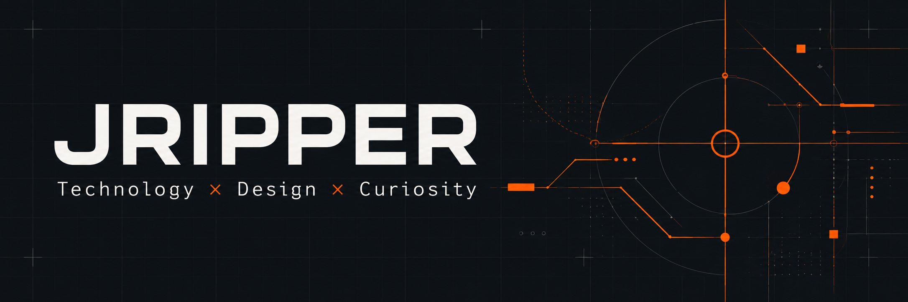

  

### Technology × Design × Curiosity

I explore the intersection of **technology, design and creativity** — building, hacking and experimenting along the way.

Software meets hardware. Automation fades into the background. And things should feel as good as they work.

### // BUILD

**AI & Automation · Home Assistant · IoT & Hardware**

Small tools, connected things and solutions to problems that sometimes didn't need solving.

### // DESIGN

**UX/UI · Graphic Design**

Making things clearer, simpler and a little more interesting to look at. The interface is part of the experiment.

### // EXPLORE

**Photography · VR/XR**

Different lenses, new perspectives and interfaces that don't stop at the edge of a screen.

### // LAB

This is where experiments end up. Some become useful. Some just teach me how not to do it next time.

A few things on the workbench:

- [bezel](https://github.com/jripper77/bezel) — exploring USB smart screens through a fork of [Bezel Studio](https://github.com/slipalison/bezel).
- [wiki-proxy](https://github.com/jripper77/wiki-proxy) — a small corner of the lab.
- [AutoGPT](https://github.com/jripper77/AutoGPT) — an earlier AI rabbit hole, forked from [AutoGPT](https://github.com/Significant-Gravitas/AutoGPT).

---

☕ <a href="https://ko-fi.com/jripper">Fuel the experiments</a> · Ko-fi
